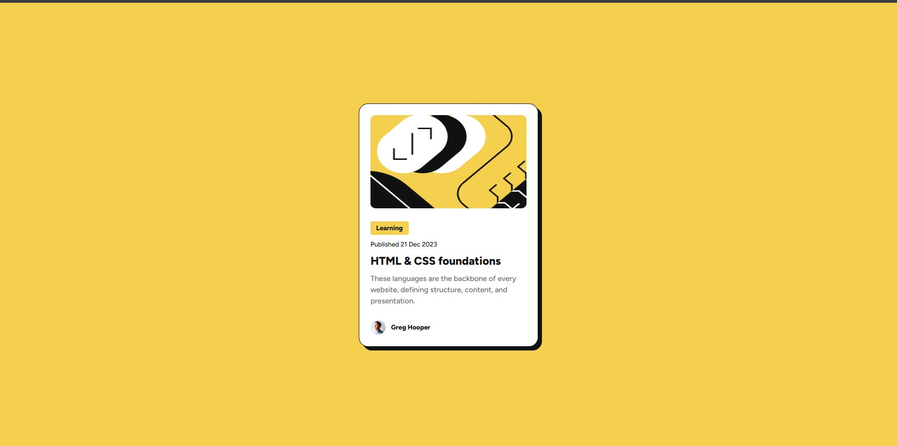
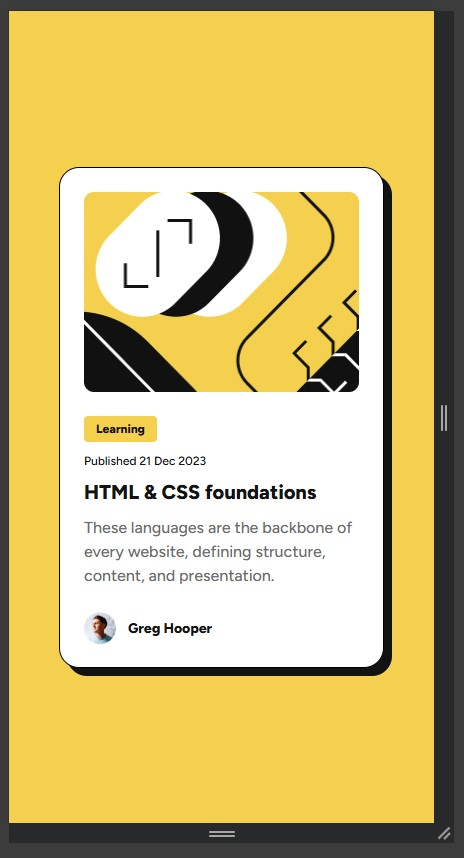
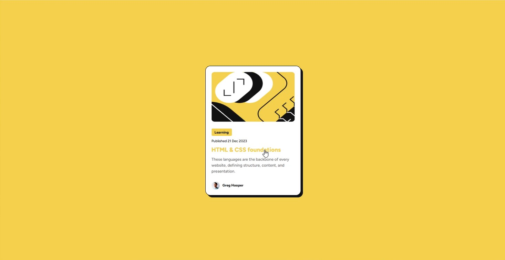

# Frontend Mentor - Blog preview card solution

This is a solution to the [Blog preview card challenge on Frontend Mentor](https://www.frontendmentor.io/challenges/blog-preview-card-ckPaj01IcS). Frontend Mentor challenges help you improve your coding skills by building realistic projects. 

## Table of contents

- [Overview](#overview)
  - [The challenge](#the-challenge)
  - [Screenshot](#screenshot)
  - [Links](#links)
- [My process](#my-process)
  - [Built with](#built-with)
  - [What I learned](#what-i-learned)
  - [Continued development](#continued-development)
- [Author](#author)

**Note: Delete this note and update the table of contents based on what sections you keep.**

## Overview

### The challenge

Users should be able to:

- See hover and focus states for all interactive elements on the page

### Screenshot

Desktop View

Mobile View

Desktop View

### Links

- Solution URL: [Add solution URL here](https://your-solution-url.com)
- Live Site URL: [Add live site URL here](https://your-live-site-url.com)

## My process

### Built with

- Semantic HTML5 markup
- CSS custom properties
- Flexbox

### What I learned

With this challenge I was able to understand a litte bit more how to work with Figma, how it makes easier to get the proportions correctly.

### Continued development

I'm going to keep doing this challenges and keep solidifying my skills, theres a lot more that I need to learn.

## Author

- Website - [Agner Shimokawa](https://github.com/AgnerShimokawa)
- Frontend Mentor - [@AgnerShimokawa](https://www.frontendmentor.io/profile/AgnerShimokawa)
- LinkedIn - [Agner Shimokawa](https://www.linkedin.com/in/agner-shimokawa/)